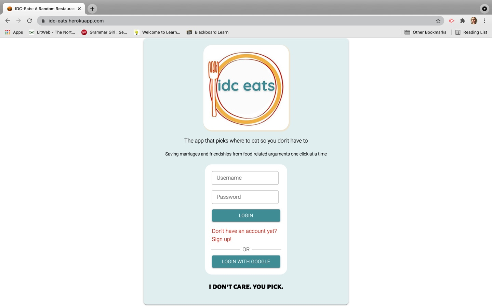
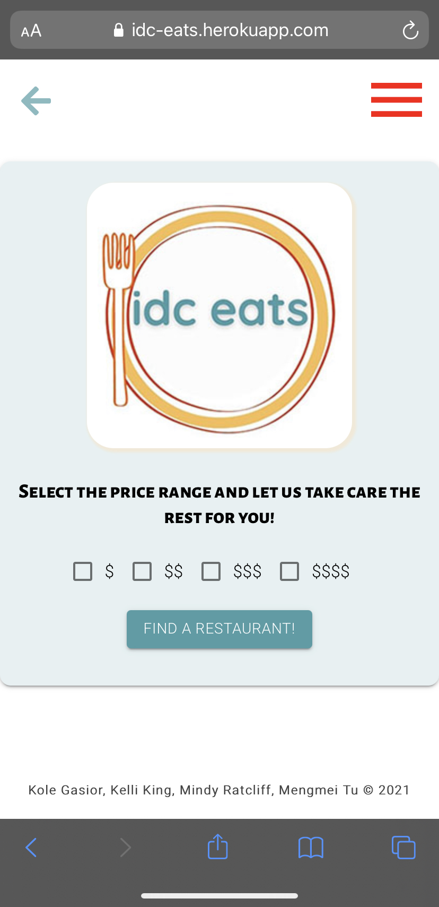

# IDC-Eats
    

This application randomly generates a restaurant for a user based on geolocation and preset user preferences. A MySQL database is used along with Passport, Framer-Motion, and Material-UI as well as the Yelp API.

This project was bootstrapped with [Create React App](https://github.com/facebook/create-react-app).

## Table of Contents
1.) [Scripts](#scripts)

2.) [Credits](#credits)

3.) [Contributing](#contributing)

3.) [Questions/Contact](#questions/contact)

4.) [License](#license)

## Scripts

In the project directory, you can run:

### `npm start`

Runs the app in the development mode.\
Open [http://localhost:3000](http://localhost:3000) to view it in the browser.

The page will reload if you make edits.\
You will also see any lint errors in the console.

### `npm test`

Launches the test runner in the interactive watch mode.\
See the section about [running tests](https://facebook.github.io/create-react-app/docs/running-tests) for more information.

### `npm run build`

Builds the app for production to the `build` folder.\
It correctly bundles React in production mode and optimizes the build for the best performance.

The build is minified and the filenames include the hashes.\
Your app is ready to be deployed!

See the section about [deployment](https://facebook.github.io/create-react-app/docs/deployment) for more information.

### `npm run eject`

**Note: this is a one-way operation. Once you `eject`, you can’t go back!**

If you aren’t satisfied with the build tool and configuration choices, you can `eject` at any time. This command will remove the single build dependency from your project.

Instead, it will copy all the configuration files and the transitive dependencies (webpack, Babel, ESLint, etc) right into your project so you have full control over them. All of the commands except `eject` will still work, but they will point to the copied scripts so you can tweak them. At this point you’re on your own.

You don’t have to ever use `eject`. The curated feature set is suitable for small and middle deployments, and you shouldn’t feel obligated to use this feature. However we understand that this tool wouldn’t be useful if you couldn’t customize it when you are ready for it.

## Learn More

You can learn more in the [Create React App documentation](https://facebook.github.io/create-react-app/docs/getting-started).

To learn React, check out the [React documentation](https://reactjs.org/).

### Code Splitting

This section has moved here: [https://facebook.github.io/create-react-app/docs/code-splitting](https://facebook.github.io/create-react-app/docs/code-splitting)

### Analyzing the Bundle Size

This section has moved here: [https://facebook.github.io/create-react-app/docs/analyzing-the-bundle-size](https://facebook.github.io/create-react-app/docs/analyzing-the-bundle-size)

### Making a Progressive Web App

This section has moved here: [https://facebook.github.io/create-react-app/docs/making-a-progressive-web-app](https://facebook.github.io/create-react-app/docs/making-a-progressive-web-app)

### Advanced Configuration

This section has moved here: [https://facebook.github.io/create-react-app/docs/advanced-configuration](https://facebook.github.io/create-react-app/docs/advanced-configuration)

### Deployment

This section has moved here: [https://facebook.github.io/create-react-app/docs/deployment](https://facebook.github.io/create-react-app/docs/deployment)

### `npm run build` fails to minify

This section has moved here: [https://facebook.github.io/create-react-app/docs/troubleshooting#npm-run-build-fails-to-minify](https://facebook.github.io/create-react-app/docs/troubleshooting#npm-run-build-fails-to-minify)

## Credits

The following references were made during the development of this project:

[Yelp](https://www.yelp.com/developers)

[MDN](https://developer.mozilla.org/en-US/)

[React](https://reactjs.org)

[Framer](https://www.framer.com/motion/)

[MaterialUI](https://material-ui.com)

[MySQL](https://dev.mysql.com/doc/)

[Jankord](https://www.brettjankord.com/2020/09/21/how-to-inject-server-rendered-html-into-create-react-app-with-express/)

[Passport](http://www.passportjs.org)

[Formik](https://formik.org)

## Contributing

Contributor Covenant Code of Conduct

Our Pledge

We as members, contributors, and leaders pledge to make participation in our community a harassment-free experience for everyone, regardless of age, body size, visible or invisible disability, ethnicity, sex characteristics, gender identity and expression, level of experience, education, socio-economic status, nationality, personal appearance, race, religion, or sexual identity and orientation.

We pledge to act and interact in ways that contribute to an open, welcoming, diverse, inclusive, and healthy community.

Our Standards

Examples of behavior that contributes to a positive environment for our community include:

Demonstrating empathy and kindness toward other people Being respectful of differing opinions, viewpoints, and experiences Giving and gracefully accepting constructive feedback Accepting responsibility and apologizing to those affected by our mistakes, and learning from the experience Focusing on what is best not just for us as individuals, but for the overall community Examples of unacceptable behavior include:

The use of sexualized language or imagery, and sexual attention or advances of any kind Trolling, insulting or derogatory comments, and personal or political attacks Public or private harassment Publishing others' private information, such as a physical or email address, without their explicit permission Other conduct which could reasonably be considered inappropriate in a professional setting Enforcement Responsibilities

Community leaders are responsible for clarifying and enforcing our standards of acceptable behavior and will take appropriate and fair corrective action in response to any behavior that they deem inappropriate, threatening, offensive, or harmful.

Community leaders have the right and responsibility to remove, edit, or reject comments, commits, code, wiki edits, issues, and other contributions that are not aligned to this Code of Conduct, and will communicate reasons for moderation decisions when appropriate.

Scope

This Code of Conduct applies within all community spaces, and also applies when an individual is officially representing the community in public spaces. Examples of representing our community include using an official e-mail address, posting via an official social media account, or acting as an appointed representative at an online or offline event.

Enforcement

Instances of abusive, harassing, or otherwise unacceptable behavior may be reported to the community leaders responsible for enforcement at email at the contacts provided in the Contacts information. All complaints will be reviewed and investigated promptly and fairly.

All community leaders are obligated to respect the privacy and security of the reporter of any incident.

Enforcement Guidelines

Community leaders will follow these Community Impact Guidelines in determining the consequences for any action they deem in violation of this Code of Conduct:

Correction
Community Impact: Use of inappropriate language or other behavior deemed unprofessional or unwelcome in the community.

Consequence: A private, written warning from community leaders, providing clarity around the nature of the violation and an explanation of why the behavior was inappropriate. A public apology may be requested.

Warning
Community Impact: A violation through a single incident or series of actions.

Consequence: A warning with consequences for continued behavior. No interaction with the people involved, including unsolicited interaction with those enforcing the Code of Conduct, for a specified period of time. This includes avoiding interactions in community spaces as well as external channels like social media. Violating these terms may lead to a temporary or permanent ban.

Temporary Ban
Community Impact: A serious violation of community standards, including sustained inappropriate behavior.

Consequence: A temporary ban from any sort of interaction or public communication with the community for a specified period of time. No public or private interaction with the people involved, including unsolicited interaction with those enforcing the Code of Conduct, is allowed during this period. Violating these terms may lead to a permanent ban.

Permanent Ban
Community Impact: Demonstrating a pattern of violation of community standards, including sustained inappropriate behavior, harassment of an individual, or aggression toward or disparagement of classes of individuals.

Consequence: A permanent ban from any sort of public interaction within the community.

Attribution

This Code of Conduct is adapted from the Contributor Covenant, version 2.0, available at https://www.contributor-covenant.org/version/2/0/code_of_conduct.html.

Community Impact Guidelines were inspired by Mozilla's code of conduct enforcement ladder.

For answers to common questions about this code of conduct, see the FAQ at https://www.contributor-covenant.org/faq. Translations are available at https://www.contributor-covenant.org/translations.

## Questions/Contact

Mengmei Tu

Github username: mmeii

Email: redmmeii@gmail.com

Kelli King

Github username: thorgriffs

Email: 22.kelliking@gmail.com

Kole Gasior

Github username: jkole822

Email: jkole822@gmail.com

Mindy Ratcliff

Github username: Mindyratcliff

Email: mindy.ratcliff@gmail.com

## License

MIT License

Copyright (c) 2021 Mengmei Tu, Kelli King, Kole Gasior, Mindy Ratcliff

Permission is hereby granted, free of charge, to any person obtaining a copy of this software and associated documentation files (the "Software"), to deal in the Software without restriction, including without limitation the rights to use, copy, modify, merge, publish, distribute, sublicense, and/or sell copies of the Software, and to permit persons to whom the Software is furnished to do so, subject to the following conditions:

The above copyright notice and this permission notice shall be included in all copies or substantial portions of the Software.

THE SOFTWARE IS PROVIDED "AS IS", WITHOUT WARRANTY OF ANY KIND, EXPRESS OR IMPLIED, INCLUDING BUT NOT LIMITED TO THE WARRANTIES OF MERCHANTABILITY, FITNESS FOR A PARTICULAR PUR POSE AND NONINFRINGEMENT. IN NO EVENT SHALL THE AUTHORS OR COPYRIGHT HOLDERS BE LIABLE FOR ANY CLAIM, DAMAGES OR OTHER LIABILITY, WHETHER IN AN ACTION OF CONTRACT, TORT OR OTHERWISE, ARISING FROM, OUT OF OR IN CONNECTION WITH THE SOFTWARE OR THE USE OR OTHER DEALINGS IN THE SOFTWARE.
